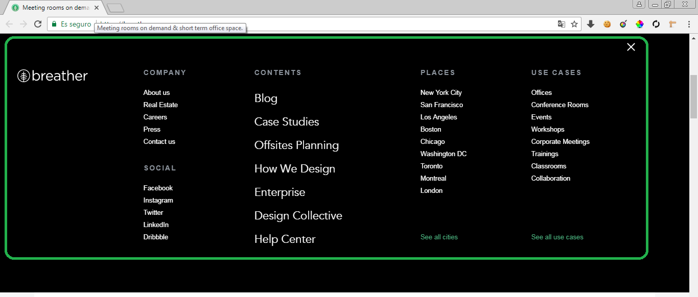
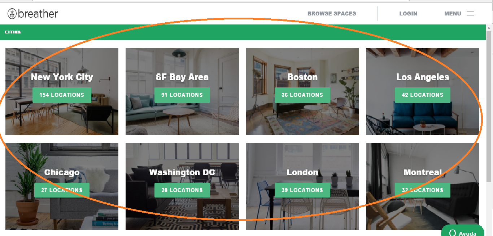
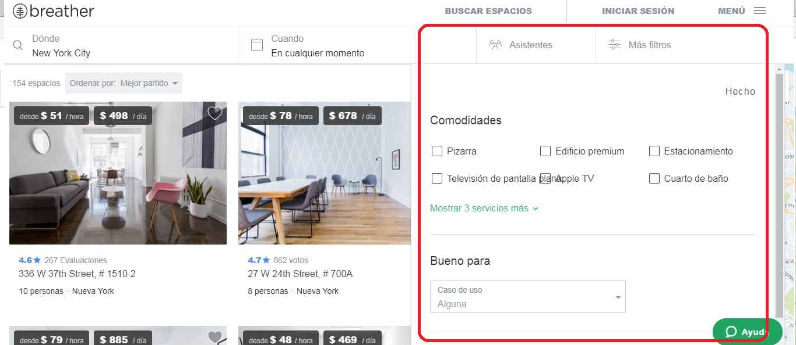
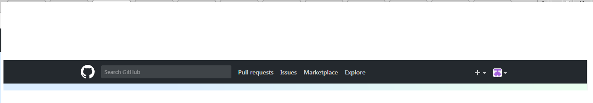
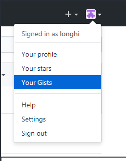
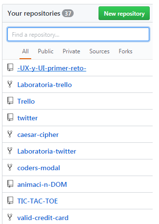
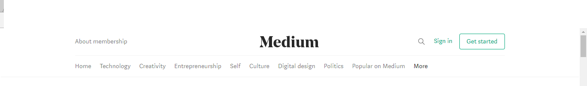
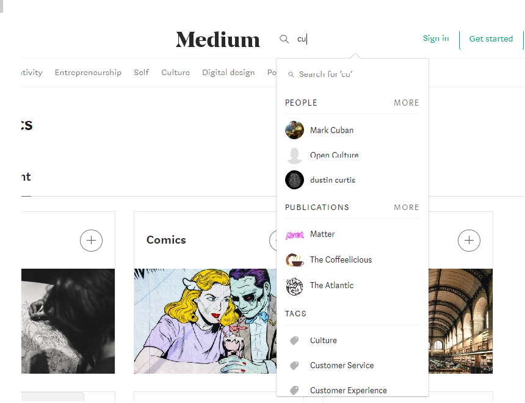

# TIPOS DE NAVEGACIÓN
###  Pagina BREATHER:
 **TIPO GLOBAL :** Al dar click en el menu de la pagina me brinda una navegacion global  que me ayuda a explorar todas las opciones del sitio.

**TIPO CONTEXTUAL :** Recomienda diferentes cuartos con su precio y localización.

 **TIPO FILTRADA :** Dentro de un lugar de un cuarto que desee tiene una filtro para tener una busqueda mas exacta de la habitacion deseado.

### Pagina GITHUB:

 **TIPO FACETADA :** Diferentes categorias ya definidas por la pagina.

 **TIPO LOCAL :** Me brinda una navegacion dentro de la pagina  ayuda al usuario a explorar esa vista en particular.

 **TIPO FILTRADA :** Me brinda una navegacion dentro de la pagina  ayuda al usuario a explorar esa vista en particular.

**TIPO FILTRADA :** Arriba da un pequeña sugerencias sobre otros temas para entrar y abajo me muestra a otros desarrolladores que publican.

### Pagina Medium:

 **TIPO GLOBAL:** Nos muestra una navegacion para entra dentro de la pagina.

**TIPO FILTRADA:** Muestra un buscador para elegir lo que deseo encontrar.

